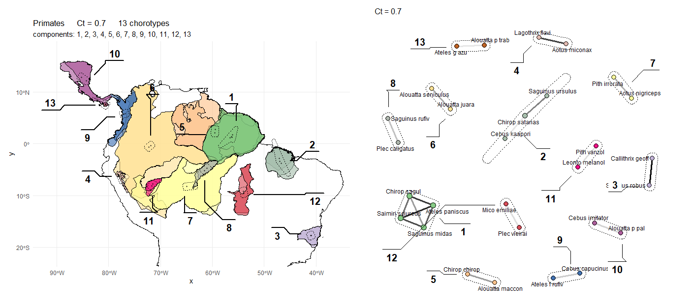

<div>
  
   </div>

```r 
SCAN -> Mapping Biogeographical Units (Chorotypes) based on a Network Analysis of Spatial Congruences 
```
### What is SCAN about?
In **Biogeography**, the field of biology that studies the spatial distribution of species and the evolution of their environments, a pervasive question remains: why do unrelated species often exhibit similar geographic distributions? The phenomenon of distributional congruence inspired Wallace — the father of Biogeography and co-founder of the Theory of Evolution by Natural Selection — as well as many subsequent researchers, to develop insights about the evolution and ecology of species and environments. Ideally, congruence should be among the primary criteria for any biogeographic analysis based on species distributions. Unfortunately, until now, most methods have not employed spatial congruence between distributions as an explicit and controllable parameter.

 
 <table>
  <tr>
  <td>
    
  </td>
  <td>
    Psophia leucoptera <i>shares its distribution with other birds at the Inambari Endemic Area, SW Amazonia</i>
  </td>
  </tr>
</table>

What about a framework that proposes spatial congruence between species as the primary criterion for connections in a network of spatial relationships, aggregating such pairwise relationships to detect independent, potentially overlapping spatial patterns while simultaneously describing distribution gradients? Such a framework would address two analytical requirements not previously combined, representing a significant advance in the biogeographical analysis of species distributions.

<table>
  <tr>
  <td>
    
  </td>
  <td>
    <i>Examples of Primate Chorotypes across South and Central Americas at a Spatial Congruence Cs = 0.6 - their network structures are show in the right panel</i>
  </td>
  </tr>
</table>

The algorithm applies objective criteria to assess the spatial properties of entities such as raw species distributions, though it can be extrapolated to analyze environments and geographic regions. Recognized patterns may range from highly congruent configurations, where species exhibit very similar distributions and are highly clustered in their graph spatial representations, to assemblages characterized by less overlap and relaxed network spatial connections. When species overlap or replace one another along transitional and ecological zones, these patterns are recognized as liner connections in a network. This flexibility enables the recognition of potentialy dynamic spatial processes and traces of differential responses to evolutionary or ecological filters, while facilitating comparisons between species and regions based on natural and objective criteria, including the number of species in groups, their level of congruence, the ratio of shared to total distributional area, and numerous metrics derived from network analytics.

## 🚀 Installation & Usage
Unlike previous versions, **SCAN V 1.0 runs on a current R version** (tested on R 4.5.2). You do not need to downgrade your R installation.
### Step 1: Install R and RStudio
If you haven't already, please download and install the latest versions:
1.  **Download R:** [https://cran.r-project.org/](https://cran.r-project.org/)
2.  **Download RStudio:** [https://posit.co/download/rstudio-desktop/](https://posit.co/download/rstudio-desktop/)
### Step 2: Install Required Packages
Open RStudio, copy the code below, paste it into the Console, and press Enter. This will install all necessary dependencies (including the spatial engines).

```r
install.packages(c(
  "shiny",
  "shinydashboard",
  "sf",
  "leaflet",
  "ggplot2",
  "dplyr",
  "igraph",
  "tidygraph",
  "ggraph",
  "readr",
  "units",
  "htmltools",
  "lwgeom", 
  "RColorBrewer",
  "DT"
))
```
### Step 3: Run SCAN
Once the packages are installed, you can launch the SCAN Engine directly from GitHub by typing this in your R console:
```r
library(shiny)
# Run SCAN directly from the repository
runGitHub("SCAN_R_4.5.2", "cassianogatto")
```
When you run SCAN remotely for the first time is recommended to downloado the [example](https://github.com/cassianogatto/SCAN_R_4.5.2/examples) folder in this repository. A sample of Neotropical Primate distributions is available to test 1) map loading, as the shp files are properly configurated and can be used as a template, 2) Spatial Congruence Cs calculus, as the data is small enough for a rapid test of the App, 3) SCAN algorithm, and 4) Graph and Map interfaces of the SCAN App.

### Step 4: Alternatively, you can download or clone the [SCAN_R_4.5.2](https://github.com/cassianogatto/SCAN_R_4.5.2) directory in your computer.
After downloading the folder open ui.R and server.R in RStudio, call for the Shiny package, and run the App:
```r
library(shiny)
# Run SCAN
shiny::runApp('C:/SCAN_R4.5.2')
```
Or use the "run App" buttom to start the SCAN shiny app

### Example
The folder <strong>example</strong> brings a small sample of New World Primate distributions to practice and build your first Chorotypes!

### Perspectives...
We are applying the method to the analysis of endemic patterns of South American Birds and Primates (with collaborators). SCAN is super intuitive, allows the gattering of new insights about species distributions, and now is fully converted to a standard network analysis (in R). Many network tools and concepts can now be integrated to biogeographical analysis.

The **paper** with concepts is [here](https://journals.plos.org/plosone/article?id=10.1371/journal.pone.0245818) 

My **thesis** is also available from [here](https://repositorio.inpa.gov.br/bitstream/1/39803/3/tese_cassiano.pdf) (Intro in Portuguese, Chaps 1 & 2 in English).
